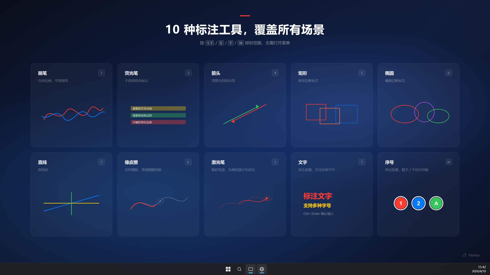
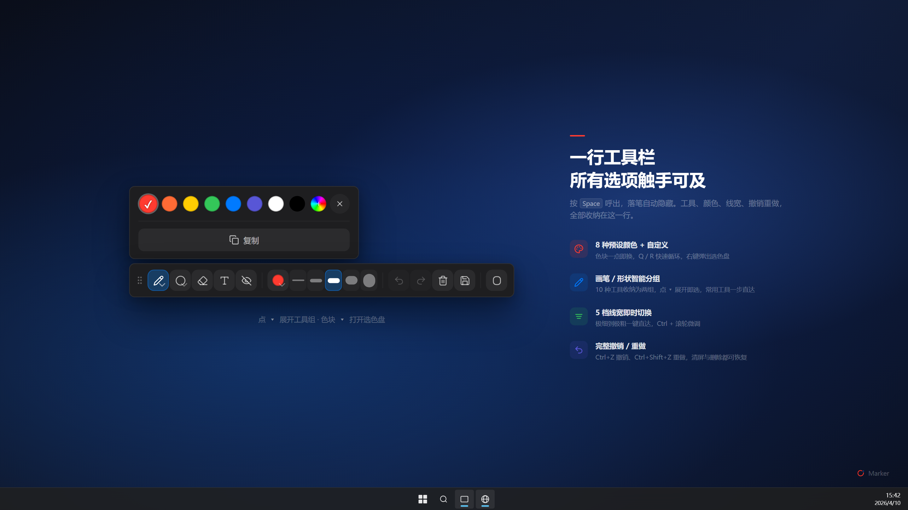

  
  <h1>Marker</h1>
  

    <a href="./README.md">English</a>
  

  

    
    
    
    
    
  

  
<strong>轻量级屏幕标注工具</strong>（~4.5 MB）— 按下快捷键（<strong>快捷键优先</strong>），随时在桌面上自由绘画、标注。适用于课堂演示 / 会议讲解 / 录屏批注。<strong>免费开源。</strong>

  

**目录：** [下载安装](#下载安装) · [快速开始](#快速开始) · [功能一览](#功能一览) · [快捷键](#快捷键一览) · [标注文件](#标注文件) · [反馈](#反馈与-issue) · [开发构建](#开发构建)

## 下载安装

  
  
  

**[下载最新版本](https://github.com/AomeNero/marker/releases/latest)** — 在 Assets 列表中选择对应平台的安装包下载。Windows 另提供 **绿色免安装版**（`*_x64_portable.zip`）：解压即用，配置写在程序目录下的 `data\`，不写系统 AppData。

## 快速开始

1. **安装并启动** — Marker 在 **系统托盘** 静默运行，不会弹出窗口。
2. **进入标注模式** — 按 <kbd>Alt</kbd> + <kbd>G</kbd>（macOS 为 <kbd>Option</kbd> + <kbd>G</kbd>）。
3. **绘画与标注** — 数字键与 <kbd>E</kbd>/<kbd>T</kbd>/<kbd>N</kbd> 切换工具；要操作下层应用时按 <kbd>V</kbd> 隐藏标注，完成后再按恢复；按 <kbd>Esc</kbd> 退出。

> **刚上手？** 按 <kbd>Space</kbd> 呼出工具栏。完整列表见 [快捷键一览](#快捷键一览)。

## 功能一览

- **轻量高效** — 安装包仅 ~1.5 MB（Rust + Canvas），内存占用极低；托盘静默运行（无多余服务、无遥测）
- **随处标注** — 在任何应用上方绘制，覆盖全屏包括任务栏
- **多显示器支持** — 所有屏幕同时可画，标注各自留在所在屏幕；混合 DPI 下每屏坐标精确；工具栏跟随光标所在屏幕；会话中拔插显示器自动恢复
- **10 种工具** — 画笔、荧光笔、激光笔、箭头、矩形、椭圆、直线、橡皮擦、文字、序号
- **灵活工具栏** — 进入标注自动显示，**落笔画线时自动隐藏**，按 <kbd>Space</kbd> 召回 / 开关，或在设置中**常驻显示**；紧凑面板，点「展开」查看完整选项，面板内可撤销、复制、切换白板；也支持**独立浮动窗口**
- **隐藏 / 显示标注** — 按 <kbd>V</kbd> 临时隐藏全部标注（例如需要点击下层应用时），再按恢复
- **全键盘操控** — 每个操作都有快捷键，无需菜单
- **保留标注** — 可在「白板与内容」中开启退出后保留；下次进入自动恢复
- **标注文件保存 / 加载** — 一键把全部屏幕的标注（含白板）存为 `.marker` 文件，随时打开恢复现场、或叠加到当前画面作为模板；安装版可直接双击 `.marker` 文件打开
- **白板模式** — 可设为默认进入白板，或按 <kbd>W</kbd> 切换；内容与切换行为均在「白板与内容」中配置
- **白板复制** — 在白板模式下按 <kbd>Ctrl</kbd>/<kbd>Command</kbd> + <kbd>C</kbd> 可复制当前白板为图片

<table>
<tr>
<td width="50%">

</td>
<td width="50%">

</td>
</tr>
</table>

## 快捷键一览

在 **macOS** 上，<kbd>Ctrl</kbd> 对应 <kbd>Command</kbd>（⌘），<kbd>Alt</kbd> 对应 <kbd>Option</kbd>（⌥）。

### 全局快捷键

| 功能 | Windows | macOS |
| :--- | :--- | :--- |
| 开启 / 退出标注模式 | <kbd>Alt</kbd> + <kbd>G</kbd> | <kbd>Option</kbd> + <kbd>G</kbd> |
| 清除所有标注 | <kbd>Alt</kbd> + <kbd>E</kbd> | <kbd>Option</kbd> + <kbd>E</kbd> |

### 工具切换

| 按键 | 工具 | 按键 | 工具 |
| :---: | :--- | :---: | :--- |
| <kbd>V</kbd> | 隐藏 / 显示标注 | <kbd>6</kbd> | 椭圆 |
| <kbd>1</kbd> | 画笔 | <kbd>7</kbd> | 直线 |
| <kbd>2</kbd> | 荧光笔 | <kbd>E</kbd> | 橡皮擦 |
| <kbd>3</kbd> | 激光笔 | <kbd>T</kbd> | 文字 |
| <kbd>4</kbd> | 箭头 | <kbd>N</kbd> | 序号 |
| <kbd>5</kbd> | 矩形 |  |  |

### 常用操作

| 功能 | Windows | macOS |
| :--- | :--- | :--- |
| 呼出工具栏 | <kbd>Space</kbd>（落笔画线时自动隐藏） | <kbd>Space</kbd>（落笔画线时自动隐藏） |
| 切换橡皮擦模式（轨迹 / 对象） | 选中橡皮擦后再按 <kbd>E</kbd> | 选中橡皮擦后再按 <kbd>E</kbd> |
| 工具栏常驻 / 布局 | 设置 → 常规 | 设置 → 常规 |
| 复制屏幕 / 白板 | <kbd>Ctrl</kbd> + <kbd>C</kbd> | <kbd>Command</kbd> + <kbd>C</kbd> |
| 保存标注（全部屏幕） | <kbd>Alt</kbd> + <kbd>S</kbd> | <kbd>Option</kbd> + <kbd>S</kbd> |
| 打开标注文件（替换）/ 插入（叠加） | <kbd>Alt</kbd> + <kbd>O</kbd> / <kbd>I</kbd> | <kbd>Option</kbd> + <kbd>O</kbd> / <kbd>I</kbd> |
| 白板模式切换 | <kbd>W</kbd> | <kbd>W</kbd> |
| 撤销 / 重做 | <kbd>Ctrl</kbd> + <kbd>Z</kbd> / <kbd>Y</kbd> | <kbd>Command</kbd> + <kbd>Z</kbd> / <kbd>Y</kbd> |
| 调整线宽 | <kbd>Ctrl</kbd> + 滚轮 | <kbd>Command</kbd> + 滚轮（画笔、激光笔与形状共用；荧光笔/橡皮擦/文字各自独立） |
| 退出标注 | <kbd>Esc</kbd> | <kbd>Esc</kbd> |

<strong>全部快捷键</strong>

#### 修饰键绘制

| 绘制内容 | Windows | macOS |
| :--- | :--- | :--- |
| 当前工具（默认画笔） | 拖动 | 拖动 |
| 直线 | <kbd>Alt</kbd> + 拖动 | <kbd>Option</kbd> + 拖动 |
| 矩形 | <kbd>Ctrl</kbd> + 拖动 | <kbd>Command</kbd> + 拖动 |
| 正方形 | <kbd>Ctrl</kbd> + <kbd>Alt</kbd> + 拖动 | <kbd>Command</kbd> + <kbd>Option</kbd> + 拖动 |
| 椭圆 | <kbd>Shift</kbd> + 拖动 | <kbd>Shift</kbd> + 拖动 |
| 正圆 | <kbd>Shift</kbd> + <kbd>Alt</kbd> + 拖动 | <kbd>Shift</kbd> + <kbd>Option</kbd> + 拖动 |
| 箭头 | <kbd>Ctrl</kbd> + <kbd>Shift</kbd> + 拖动 | <kbd>Command</kbd> + <kbd>Shift</kbd> + 拖动 |

#### 编辑与移动

| 操作 | 功能 |
| :--- | :--- |
| 元素拖拽 | 在「常规」设置中选择：**关闭** / **悬停拖动** / **按住 Ctrl 才拖动** |
| 双击已有文字 | 重新进入该文字的**编辑模式** |
| <kbd>T</kbd> 模式下双击空白处 | 在光标位置新建文字输入框 |

#### 颜色切换

| 操作 | 功能 |
| :--- | :--- |
| <kbd>Q</kbd> / <kbd>R</kbd> | 上一个 / 下一个颜色 |
| 鼠标右键 | 按住擦除，松开恢复原工具 |

#### 其他

| 功能 | Windows | macOS |
| :--- | :--- | :--- |
| 重做（备用） | <kbd>Ctrl</kbd> + <kbd>Shift</kbd> + <kbd>Z</kbd> | <kbd>Command</kbd> + <kbd>Shift</kbd> + <kbd>Z</kbd> |

<strong>更多设置</strong>

在 **设置 → 常规** 中可配置（工具栏显示、线宽等见 [功能一览](#功能一览)）：

- **白板与内容** — 默认进入（屏幕标注 / 白板）、退出标注后保留、按 <kbd>W</kbd> 切换时保留
- **元素拖拽** — 关闭、悬停拖动，或按住 <kbd>Ctrl</kbd>/<kbd>Command</kbd> 才拖动（橡皮擦工具下不触发）
- **橡皮擦模式** — 轨迹擦除（局部）或对象擦除（划过删除整段）；选中橡皮擦后再按 <kbd>E</kbd>（或再点工具栏橡皮擦）可切换
- **吸附角度步进** — 按住 <kbd>Alt</kbd> 绘制直线时的吸附角度间隔
- **开机自动启动** — 系统启动时自动在后台运行

## 标注文件

标注可以存成 `.marker` 文件（JSON 格式），跨设备迁移、课前备课、标注模板都靠它。

- **保存** — 工具栏「保存」按钮或 <kbd>Alt</kbd> + <kbd>S</kbd>，静默写入并提示完整路径：
  - 绿色版：程序目录下 `data\annotations\`
  - 安装版：`文档\Marker\`
  - 文件名自动带时间戳：`markeryyyyMMddHHmmss.marker`
- **打开（替换现场）** — 托盘右键「打开标注文件」或 <kbd>Alt</kbd> + <kbd>O</kbd>：清空当前标注并载入文件，一次 <kbd>Ctrl</kbd> + <kbd>Z</kbd> 可整体撤销
- **插入（叠加模板）** — 托盘右键「插入标注文件」或 <kbd>Alt</kbd> + <kbd>I</kbd>：把文件内容叠加到当前标注之上，常用于复用箭头、编号等常用布局
- **多显示器** — 一个文件包含所有屏幕的标注；加载时按显示器自动匹配归位，找不到对应屏幕的内容会移到主屏并给出提示，不会丢失
- **双击打开** — 安装版已注册 `.marker` 文件关联，双击文件即可唤起 Marker 打开；绿色版请通过托盘菜单选择文件

## 反馈与 Issue

- **报 Bug：** 设置 → **诊断** → 导出报告，再到 [GitHub Issues](https://github.com/AomeNero/marker/issues) 提交
- **隐私政策：** [PRIVACY.md](./PRIVACY.md)

## 开发构建

详见 [CONTRIBUTING.md](./CONTRIBUTING.md)（环境依赖、搭建与完整流程）。**技术栈：** Tauri v2 · Vue 3 · Vite · TypeScript · Canvas API
