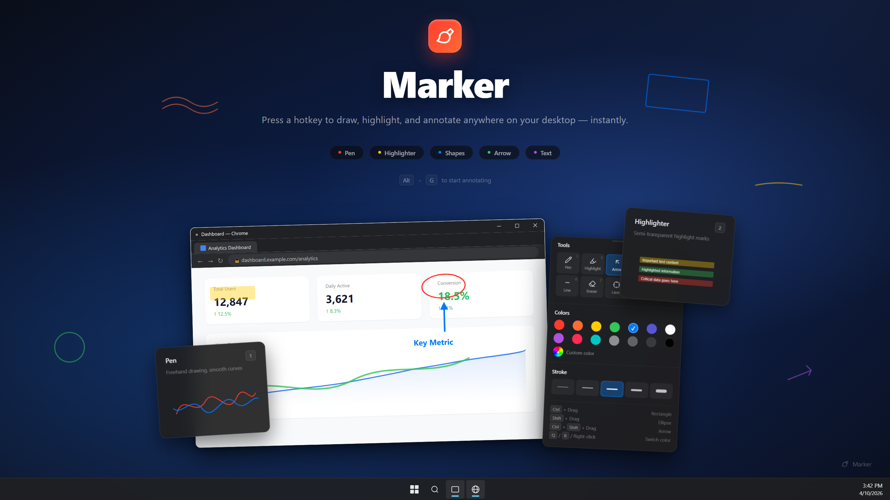
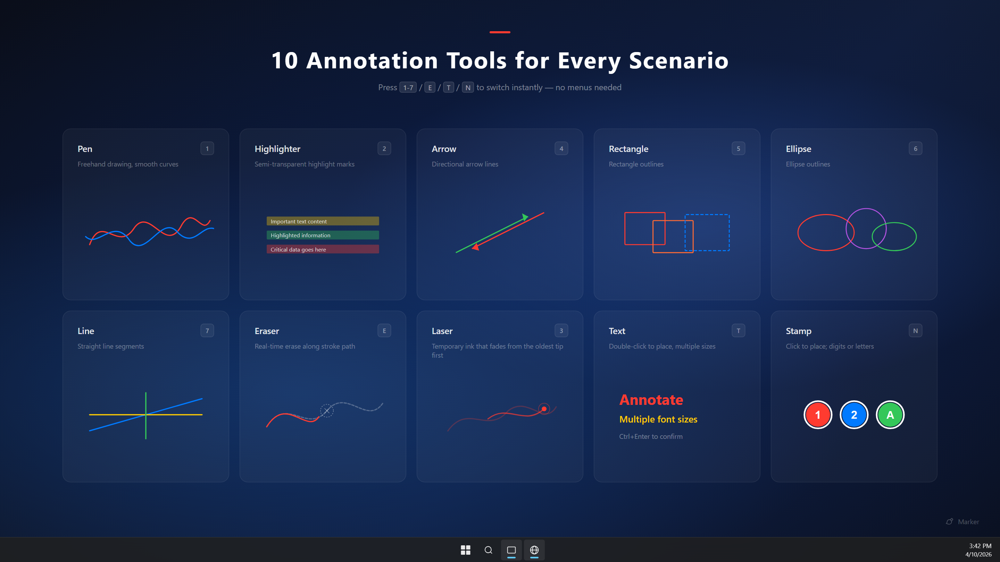
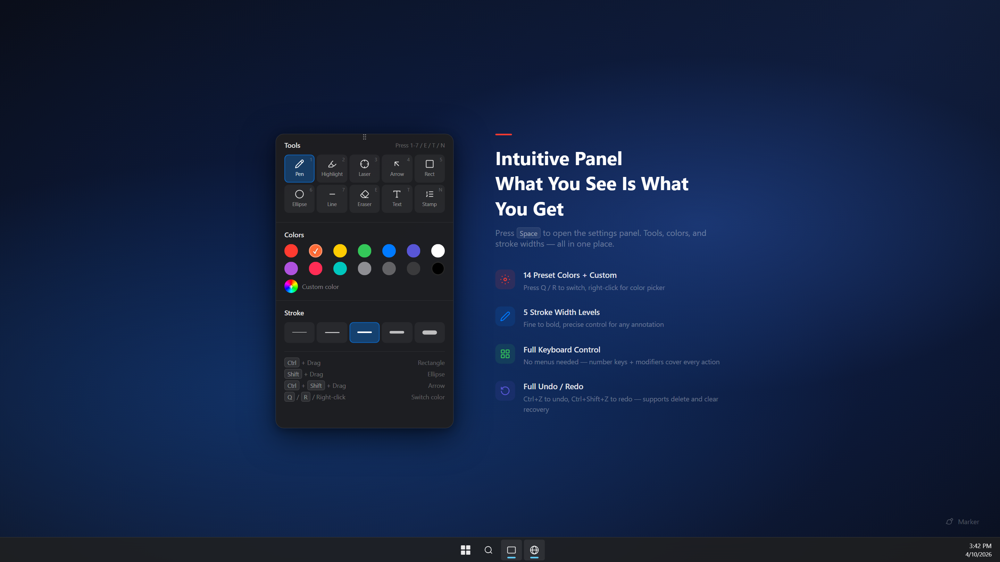

<div align="center">
  
  <h1>Marker</h1>
  <p>
    <a href="./README_zh.md">中文</a>
  </p>
  <p>
    <a href="https://github.com/AomeNero/marker/actions/workflows/ci.yml"></a>
    <a href="https://github.com/AomeNero/marker/releases/latest"></a>
    <a href="https://github.com/AomeNero/marker/releases"></a>
    <a href="./LICENSE"></a>
    <a href="https://github.com/AomeNero/marker/stargazers"></a>
    <a href="https://marker.cn/"></a>
    <a href="https://www.bilibili.com/video/BV17ygy67ETV"></a>
  </p>
  <p><strong>Lightweight screen annotation tool</strong> (~1.5 MB) — press a hotkey (<strong>keyboard-first</strong>) to instantly draw, highlight, and annotate anywhere on your desktop. Built for demos, teaching, meetings, and screen recording.<strong>Free &amp; open source.</strong></p>
</div>


<p align="center">
  
</p>

**Contents:** [Download](#download) · [Quick Start](#quick-start) · [Features](#features) · [Shortcuts](#keyboard-shortcuts) · [Feedback](#feedback--issues) · [Development](#development)

## Download

<p>
  <a href="https://github.com/AomeNero/marker/releases/latest"></a>
  <a href="https://github.com/AomeNero/marker/releases/latest"></a>
  <a href="https://github.com/AomeNero/marker/releases/latest"></a>
  <a href="https://get.microsoft.com/installer/download/9n6623x973jv?referrer=appbadge"></a>
</p>

**[Download Latest Release](https://github.com/AomeNero/marker/releases/latest)** — pick the installer for your platform from the assets list. Windows also ships a **portable zip** (`*_x64_portable.zip`): extract and run — config stays under `data\` next to the exe (no AppData).

Windows users can also install the Microsoft Store version with WinGet:

```powershell
winget install --id 9N6623X973JV --source msstore
```

> Official downloads are GitHub Releases and Microsoft Store. Third-party mirrors may be outdated or repackaged.

## Quick Start

1. **Install and launch** — Marker runs in the **system tray**; no window appears.
2. **Enter annotation mode** — press <kbd>Alt</kbd> + <kbd>G</kbd>.
3. **Draw, then click through** — use number keys plus <kbd>E</kbd>/<kbd>T</kbd>/<kbd>N</kbd> for tools; press <kbd>X</kbd> to interact with apps below while keeping annotations visible; press <kbd>Esc</kbd> to exit.

> **New here?** Press <kbd>Space</kbd> for the toolbar. See [Keyboard Shortcuts](#keyboard-shortcuts) for the full list.

## Features

- **Lightweight & fast** — ~1.5 MB installer (Rust + Canvas), minimal memory; runs quietly in the system tray (no extra daemons or telemetry)
- **Annotate anywhere** — draw over any app, including the taskbar
- **10 tools** — pen, highlighter, laser, arrow, rectangle, ellipse, line, eraser, text, stamp
- **Flexible toolbar** — shows when you enter annotation, **auto-hides while you draw**, <kbd>Space</kbd> recalls / toggles it, or enable **always-on** in Settings; compact panel with **Expand** for full options, undo, copy, and whiteboard actions in-panel; **independent floating window** with drawing / click-through toggles
- **Click-through mode** — interact with apps below while staying in the session; toggle via toolbar buttons, <kbd>Alt</kbd>+<kbd>M</kbd> (global), or <kbd>X</kbd> while drawing; disabled in whiteboard mode
- **Full keyboard control** — every action has a shortcut, no menus needed
- **Preserve drawings** — enable **Keep after exit** under Whiteboard & content to resume on re-enter
- **Whiteboard mode** — set default entry to whiteboard, or press <kbd>W</kbd> to toggle; content rules are in **Whiteboard & content** settings
- **Whiteboard copy** — copy the whiteboard as an image with <kbd>Ctrl</kbd>/<kbd>Command</kbd> + <kbd>C</kbd>

<table>
<tr>
<td width="50%">

</td>
<td width="50%">

</td>
</tr>
</table>

## Keyboard Shortcuts

On **macOS**, use <kbd>Command</kbd> (⌘) in place of <kbd>Ctrl</kbd>, and <kbd>Option</kbd> (⌥) in place of <kbd>Alt</kbd>.

### Global Shortcuts

| Action | Windows | macOS |
| :--- | :--- | :--- |
| Toggle annotation mode | <kbd>Alt</kbd> + <kbd>G</kbd> | <kbd>Option</kbd> + <kbd>G</kbd> |
| Clear all annotations | <kbd>Alt</kbd> + <kbd>E</kbd> | <kbd>Option</kbd> + <kbd>E</kbd> |
| Toggle click-through mode | <kbd>Alt</kbd> + <kbd>M</kbd> | <kbd>Option</kbd> + <kbd>M</kbd> |

### Tool Switching

| Key | Tool | Key | Tool |
| :---: | :--- | :---: | :--- |
| <kbd>V</kbd> | Hide / show annotations | <kbd>6</kbd> | Ellipse |
| <kbd>1</kbd> | Pen | <kbd>7</kbd> | Line |
| <kbd>2</kbd> | Highlighter | <kbd>E</kbd> | Eraser |
| <kbd>3</kbd> | Laser | <kbd>T</kbd> | Text |
| <kbd>4</kbd> | Arrow | <kbd>N</kbd> | Stamp |
| <kbd>5</kbd> | Rectangle |  |  |

### Common Actions

| Action | Windows | macOS |
| :--- | :--- | :--- |
| Toolbar (toggle) | <kbd>Space</kbd> (auto-hides while drawing) | <kbd>Space</kbd> (auto-hides while drawing) |
| Click-through (while drawing) | <kbd>X</kbd> | <kbd>X</kbd> |
| Cycle eraser mode (stroke / object) | <kbd>E</kbd> again while eraser selected | <kbd>E</kbd> again while eraser selected |
| Toolbar always-on / layout | Settings → General | Settings → General |
| Copy screen / whiteboard | <kbd>Ctrl</kbd> + <kbd>C</kbd> | <kbd>Command</kbd> + <kbd>C</kbd> |
| Whiteboard toggle | <kbd>W</kbd> | <kbd>W</kbd> |
| Undo / Redo | <kbd>Ctrl</kbd> + <kbd>Z</kbd> / <kbd>Y</kbd> | <kbd>Command</kbd> + <kbd>Z</kbd> / <kbd>Y</kbd> |
| Stroke width | <kbd>Ctrl</kbd> + Scroll | <kbd>Command</kbd> + Scroll (pen, laser & shapes share; highlighter/eraser/text separate) |
| Exit | <kbd>Esc</kbd> | <kbd>Esc</kbd> |

<details>
<summary><strong>All shortcuts</strong></summary>

#### Drawing with Modifier Keys

| Draws | Windows | macOS |
| :--- | :--- | :--- |
| Current tool (default: pen) | Drag | Drag |
| Line | <kbd>Alt</kbd> + Drag | <kbd>Option</kbd> + Drag |
| Rectangle | <kbd>Ctrl</kbd> + Drag | <kbd>Command</kbd> + Drag |
| Square | <kbd>Ctrl</kbd> + <kbd>Alt</kbd> + Drag | <kbd>Command</kbd> + <kbd>Option</kbd> + Drag |
| Ellipse | <kbd>Shift</kbd> + Drag | <kbd>Shift</kbd> + Drag |
| Circle | <kbd>Shift</kbd> + <kbd>Alt</kbd> + Drag | <kbd>Shift</kbd> + <kbd>Option</kbd> + Drag |
| Arrow | <kbd>Ctrl</kbd> + <kbd>Shift</kbd> + Drag | <kbd>Command</kbd> + <kbd>Shift</kbd> + Drag |

#### Edit & Move

| Action | Effect |
| :--- | :--- |
| Element dragging | In General settings: **Off** / **Hover drag** / **Hold Ctrl to drag** |
| Double-click existing text | Re-enter **edit mode** for that text |
| Double-click empty area in <kbd>T</kbd> mode | Create a new text input at cursor position |

#### Color Switching

| Action | Effect |
| :--- | :--- |
| <kbd>Q</kbd> / <kbd>R</kbd> | Previous / Next color |
| Right-click | Hold to erase; release restores the previous tool |

#### Other

| Action | Windows | macOS |
| :--- | :--- | :--- |
| Redo (alt) | <kbd>Ctrl</kbd> + <kbd>Shift</kbd> + <kbd>Z</kbd> | <kbd>Command</kbd> + <kbd>Shift</kbd> + <kbd>Z</kbd> |

</details>

<details>
<summary><strong>Advanced settings</strong></summary>

In **Settings → General** (toolbar display, click-through, and stroke width — see [Features](#features)):

- **Whiteboard & content** — default entry (screen / whiteboard), keep after exit, keep on <kbd>W</kbd> toggle
- **Element dragging** — off, hover to drag, or hold <kbd>Ctrl</kbd>/<kbd>Command</kbd> to drag (disabled while eraser is selected)
- **Eraser mode** — stroke (local erase) or object (delete whole elements); with eraser selected, press <kbd>E</kbd> again (or click the toolbar eraser again) to switch
- **Angle snap step** — snap interval for straight lines drawn with <kbd>Alt</kbd>
- **Auto start** — launch the app automatically at system startup

</details>

## Feedback & Issues

- **Bug reports:** Settings → **Diagnostics** → export a report, then open a [GitHub Issue](https://github.com/AomeNero/marker/issues)
- **Privacy:** [PRIVACY.md](./PRIVACY.md)

## Development

See [CONTRIBUTING.md](./CONTRIBUTING.md) for prerequisites, setup, and the full workflow. **Stack:** Tauri v2 · Vue 3 · Vite · TypeScript · Canvas API
